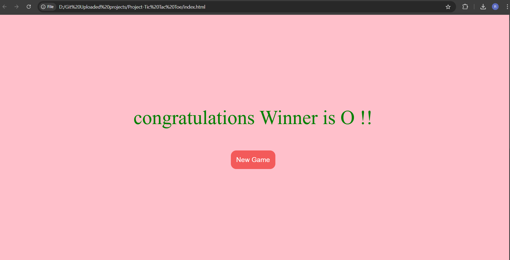

# Tic-Tac-Toe-Game
Tic-Tac-Toe-Game Using the HTML, Css and Javascript.

A classic **Tic Tac Toe game** built with **HTML**, **CSS**, and **JavaScript**. This project is a simple yet interactive game where two players take turns to mark `X` or `O` in a 3x3 grid. The first player to align three marks in a row, column, or diagonal wins!

---

## 🚀 Features

- ✅ Interactive UI with a responsive design.
- ✅ Playable by two players.
- ✅ Displays a congratulatory message for the winner.
- ✅ "Reset Game" and "New Game" options to restart anytime.
- ✅ Easy to customize and understand for beginners.

---

## 🎥 Preview

### **Winning Screenshot**


### **Gameplay Video**
[Watch the Gameplay](./unsuccessful.mp4)

---

## 🛠️ Technologies Used

- **HTML** for structuring the game interface.
- **CSS** for styling and animations.
- **JavaScript** for game logic and interactivity.

---

## 📂 Project Structure

```
|-- index.html      // Main HTML file
|-- style.css       // Styling file
|-- script.js       // Game logic
|-- successful.png  // Screenshot of the game
|-- unsuccessful.mp4 // Gameplay video
```

---

## 💡 How to Play?

1. **Player O** goes first.
2. Players take turns to click on the empty boxes to place their mark (`X` or `O`).
3. The game checks for a winner or a draw after every turn.
4. Use the **Reset Game** or **New Game** button to restart.

---

## 🔧 How to Run Locally?

1. Clone the repository:
   ```bash
   git clone https://github.com/your-username/tic-tac-toe.git
   ```
2. Navigate to the project directory:
   ```bash
   cd tic-tac-toe
   ```
3. Open `index.html` in your browser.

---

## 📸 Screenshots

| Winning Moment | Game Interface |
|-----------------|----------------|
|  |  |

---

## 🌟 Demo

**Winning in Action**  


---

## ✨ Inspiration

This project is inspired by the timeless classic Tic Tac Toe game and is a great way to practice JavaScript fundamentals.

---

## 📝 License

This project is licensed under the MIT License.

---

### 🔗 Connect with Me

If you enjoyed this project, feel free to connect with me on [GitHub](https://github.com/rohitdhumal-24)!

---

