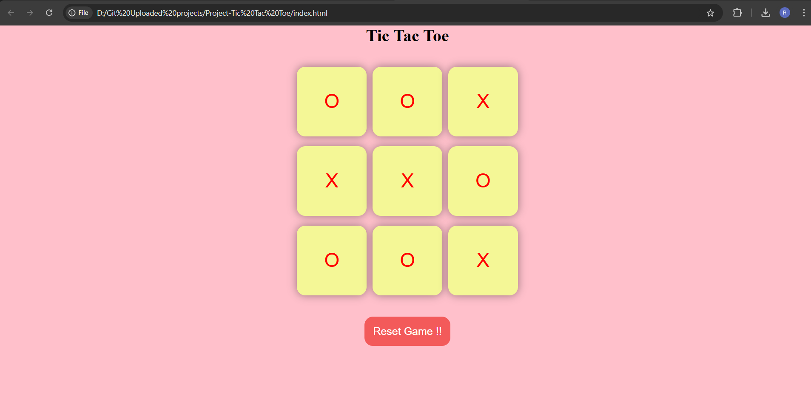

# Tic-Tac-Toe-Game
Tic-Tac-Toe-Game Using the HTML, Css and Javascript.


## 📝 Description

The **Tic-Tac-Toe Game** is a simple, interactive implementation of the classic game, built using **HTML**, **CSS**, and **JavaScript**. It provides a clean and engaging user interface to play and enjoy the game with features like resetting and starting a new game.

## ✨ Features

- 🎯 **Interactive Gameplay**: Players can click the grid boxes to make their moves.
- 🏆 **Winning Check**: Automatically checks for the winning combination and displays the winner.
- 🔄 **Reset and New Game**: Reset or start a new game anytime.
- 📱 **Responsive Design**: Designed to look great on all devices.

## 📂 Project Structure

```
├── index.html     # Main HTML file
├── style.css      # CSS for styling the game
├── script.js      # JavaScript for game logic
├── successful.png # Screenshot of the game in action
```

## 🚀 Installation

1. Clone this repository to your local machine:

   ```bash
   git clone https://github.com/yourusername/tic-tac-toe.git
   ```

2. Open the `index.html` file in your favorite browser to play the game.

## 🖼️ Screenshot

Here's how the game looks in action:



## 🎮 How to Play

1. The game starts with **Player O's turn**.
2. Click on any box to mark your move.
3. The first player to align three marks (horizontally, vertically, or diagonally) wins.
4. Use the **"Reset Game"** button to clear the board or **"New Game"** to restart.

## 🌟 Future Enhancements

- 🔗 Add multiplayer functionality over the network.
- 🤖 Implement AI for single-player mode.
- 🎨 Add themes to customize the look of the game.

## 🤝 Contributions

Contributions are welcome! Feel free to fork this repository, make changes, and submit a pull request.

## 📜 License

This project is licensed under the [MIT License](LICENSE).

---

🎉 **Enjoy playing Tic Tac Toe!** 🎉


### 🔗 Connect with Me

If you enjoyed this project, feel free to connect with me on [GitHub](https://github.com/rohitdhumal-24)!

---

